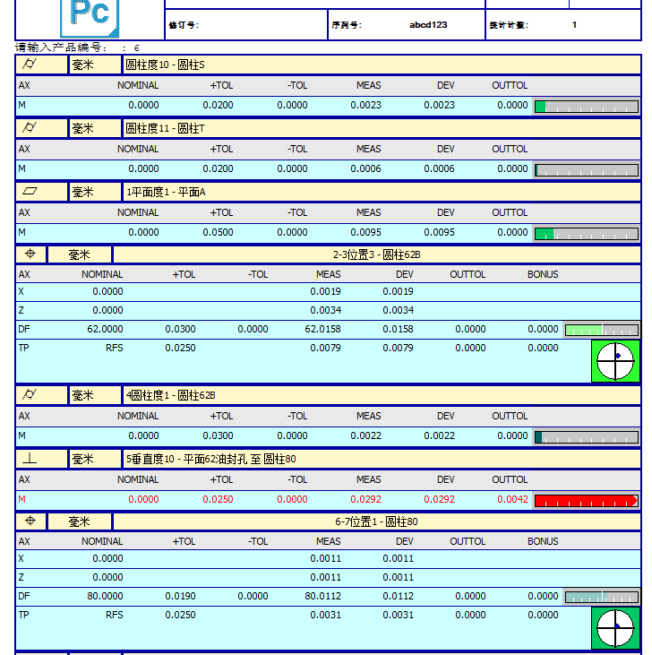

# pcdmis-export-data

pcdmis-export-data 是一个数据导出工具。  
本工具通过嵌入测量程序中工作，随测量程序一起运行，完成测量后自动导出检测数据到 Excel 表格文件中。  
  
  

* [使用说明](docs/guide.md)  
* [打包说明](docs/build.md)  
* [开发历程](docs/development%20journey.md)  

## 许可证

本项目采用 [MIT 许可证](LICENSE) 进行许可。  